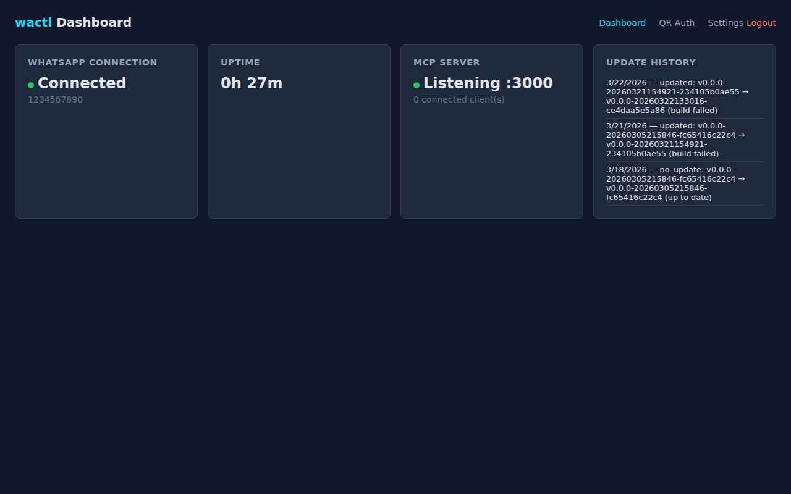
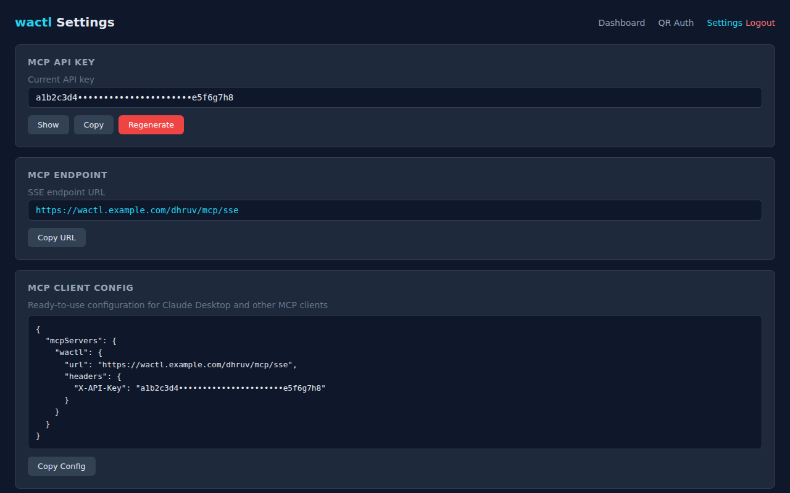
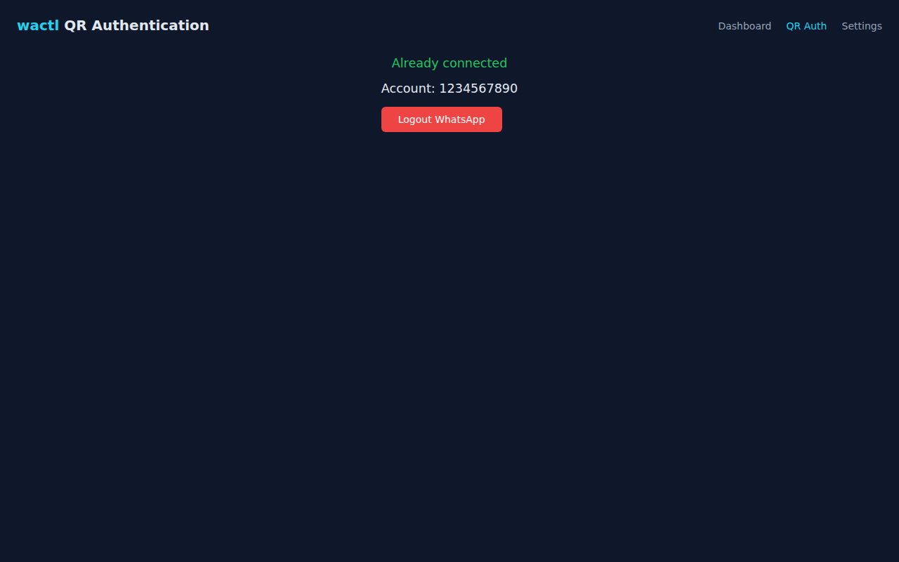

<p align="center">
  <h1 align="center">wactl</h1>
  <p align="center">
    <strong>Your WhatsApp, wired directly into your LLM.</strong>
    <br />
    Self-hosted · MCP-native · Zero babysitting
  </p>
</p>

<br />

| Dashboard | Settings | QR Auth |
|:-:|:-:|:-:|
|  |  |  |

---

## How It Works

1. **Install** — one command sets up everything on your server (Go, Node.js, Caddy, HTTPS)
2. **Scan QR** — open the admin panel in your browser, scan with WhatsApp
3. **Connect your LLM** — paste the MCP config into Claude Desktop, Cursor, or any MCP client
4. **Done** — read messages, search contacts, send messages, download media — all from your AI

wactl bridges your personal WhatsApp account to any [MCP](https://modelcontextprotocol.io)-compatible client. It runs as two processes (Go bridge + TypeScript server), updates itself daily, and notifies you if anything needs attention.

---

## Features

| | |
|---|---|
| **MCP Bridge** | 7 tools — list chats, read messages, search contacts, send texts, send files, download media, check status |
| **Web Admin Panel** | Dashboard, QR authentication, settings — all from your browser, no SSH needed |
| **Multi-Instance** | Run multiple WhatsApp accounts on one server. Each gets its own ports, data, and credentials |
| **API Key Auth** | Every MCP request requires `X-API-Key` or `Authorization: Bearer`. Constant-time comparison |
| **OAuth 2.1** | Claude web (claude.ai) support via OAuth 2.1 with PKCE. Consent screen uses your admin password. Zero extra dependencies |
| **Admin Security** | bcrypt passwords, 24h sessions, rate-limited login (5 attempts/min), httpOnly cookies |
| **Auto-Updates** | Daily cron fetches latest whatsmeow, builds, self-tests on a temp port, hot-swaps. Rolls back on failure |
| **Push Notifications** | Self-hosted [ntfy](https://ntfy.sh) or public ntfy.sh — alerts for disconnects, QR ready, reconnects, update status |
| **Contact Sync** | 5000+ contacts synced from WhatsApp on connect. Push names captured from every message |
| **Dual MCP Transport** | Streamable HTTP (`/mcp`) for modern clients + SSE (`/mcp/sse`) for legacy clients |
| **CLI** | `wactl status` · `wactl logs` · `wactl restart` · `wactl auth` · `wactl config` |
| **Docker** | Multi-stage build + docker-compose for multi-account setups |
| **One-Command Install** | Single `curl` sets up Go 1.25+, Node.js 20, Caddy, HTTPS, systemd services |
| **HTTPS by Default** | Caddy reverse proxy with automatic Let's Encrypt certificates |

---

## Quick Start

### Install

```bash
curl -fsSL https://raw.githubusercontent.com/patildhruv/wactl/main/scripts/install.sh -o install.sh
sudo bash install.sh --name myname --hostname wactl.example.com
```

Your credentials are printed once at the end — **save them**.

### Install Flags

| Flag | Description |
|---|---|
| `--name <name>` | Instance name (required, alphanumeric, max 32 chars) |
| `--hostname <domain>` | Domain for HTTPS (required on first install) |
| `--ntfy [topic]` | Enable push notifications (topic defaults to instance name) |
| `--ntfy-server <url>` | Override ntfy server (auto-detects local ntfy) |
| `--remove` | Remove an instance |

### Add More Instances

```bash
sudo bash /opt/wactl/scripts/install.sh --name another --ntfy
```

Each instance gets unique ports, separate credentials, and its own WhatsApp session.

### Docker

```bash
cd docker
cp ../.env.example ../envs/primary.env
# Edit envs/primary.env
docker compose up -d
```

### First-Time Setup

1. Open `https://<hostname>/<instance>/` in your browser
2. Log in with the admin credentials from install
3. Go to **QR Auth** → scan with WhatsApp (**Linked Devices** → **Link a Device**)
4. Session persists across restarts

---

## Connect Your LLM

### Claude Web (claude.ai)

Claude web uses OAuth — no API key needed.

1. Go to **Settings** → **MCP Servers** → **Add Custom MCP Server**
2. Enter URL: `https://<hostname>/<instance>/mcp`
3. Transport: **Streamable HTTP**, Authentication: **OAuth**
4. Claude opens a consent page — enter your **admin password** and click **Authorize**
5. Done — your WhatsApp tools appear in Claude

**Requires** `PUBLIC_URL` set in your instance `.env` (see Configuration below).

> **Note:** OAuth requires a single instance per hostname, or subdomain-based routing for multi-instance. Path-based multi-instance (`/alice/`, `/bob/`) should use API key auth instead.

### Claude Desktop / Claude Code

```json
{
  "mcpServers": {
    "whatsapp": {
      "url": "https://<hostname>/<instance>/mcp",
      "headers": {
        "Authorization": "Bearer <your-api-key>"
      }
    }
  }
}
```

Claude Code CLI:
```bash
claude mcp add --transport http wactl https://<hostname>/<instance>/mcp \
  --header "Authorization: Bearer <your-api-key>"
```

### Perplexity / Any MCP Client

- **Streamable HTTP**: `https://<hostname>/<instance>/mcp`
- **SSE (legacy)**: `https://<hostname>/<instance>/mcp/sse`
- **Auth**: `Authorization: Bearer <key>`, `X-API-Key: <key>`, or OAuth 2.1

---

## Architecture

```
┌─────────────────────────────────────────────────────┐
│            PROCESS 1: Go Bridge (port 4000)          │
│                                                     │
│   whatsmeow ←→ WhatsApp Web multi-device protocol  │
│   SQLite store (sessions + messages + contacts)     │
│   REST API (localhost only — never exposed)         │
└──────────────────────┬──────────────────────────────┘
                       │ HTTP (internal)
┌──────────────────────▼──────────────────────────────┐
│            PROCESS 2: TS Server                      │
│                                                     │
│   MCP Server ─── Streamable HTTP + SSE + OAuth 2.1 │
│   Admin Panel ── Web UI + QR auth (port 8080)      │
│   Callbacks ──── Bridge event handler (port 4001)  │
│   Updater ────── Daily whatsmeow auto-update       │
│   Notify ─────── Push notifications (ntfy)         │
│   CLI ────────── wactl command wrapper             │
└─────────────────────────────────────────────────────┘
        │
        ├──→ Caddy reverse proxy ──→ HTTPS (Let's Encrypt)
        └──→ LLM clients (Claude, Cursor, etc.)
```

---

## Configuration

All settings are in the instance `.env` file (auto-generated by the installer).

| Variable | Default | Description |
|---|---|---|
| `MCP_API_KEY` | auto-generated | API key for MCP endpoint |
| `ADMIN_PASSWORD_HASH` | auto-generated | bcrypt hash of admin password |
| `ADMIN_USER` | `admin` | Admin panel username |
| `ADMIN_PORT` | `8080` | Admin panel port |
| `MCP_PORT` | `3000` | MCP server port |
| `BRIDGE_PORT` | `4000` | Go bridge port (localhost only) |
| `NOTIFY_METHOD` | `none` | `ntfy` or `none` |
| `NTFY_TOPIC` | instance name | ntfy topic |
| `NTFY_SERVER` | auto-detected | `http://localhost:2586` or `https://ntfy.sh` |
| `AUTO_UPDATE` | `true` | Daily whatsmeow update checks |
| `AUTO_UPDATE_CRON` | `0 3 * * *` | Update schedule |
| `BASE_PATH` | `/<instance>` | URL prefix for multi-instance routing |
| `PUBLIC_URL` | — | Public HTTPS URL (e.g. `https://wactl.example.com`). Enables OAuth 2.1 for Claude web |
| `DATA_DIR` | `./data` | SQLite + session storage path |

---

## MCP Tools

| Tool | Description | Parameters |
|---|---|---|
| `list_chats` | List conversations, most recent first | `limit?` |
| `get_chat` | Message history for a chat, newest first | `chatId, limit?, before?` |
| `search_contacts` | Search saved address-book contacts | `query` |
| `resolve_jid` | Resolve any JID (phone / LID) to identity | `jid` |
| `list_group_participants` | List group members with enriched identity | `chatId` (must end in @g.us) |
| `search_messages` | Full-text search across message history | `query?, chatId?, from?, since?, until?, limit?` |
| `get_message` | Fetch a single message by ID | `messageId` |
| `send_message` | Send a text message | `to, body` |
| `send_file` | Send a file or image | `to, filePath, caption?` |
| `download_media` | Download media from a message | `messageId` |
| `get_connection_status` | Check bridge health | — |

### Enriched message shape

`get_chat`, `search_messages`, and `get_message` return messages with typed sender identity so LLMs can tell who a message is from without guessing:

```jsonc
{
  "id": "A5233142A0281C1D724E9F",
  "from": "70935881228289",                    // bare user-part (backwards compatible)
  "fromJid": "70935881228289@lid",             // full JID
  "fromType": "lid",                           // "phone" | "lid"
  "fromPhone": "918983298987",                 // resolved phone when fromType=lid and mapping known
  "senderName": "Nishitosh Khod SSPL",         // best display (saved > push)
  "senderSavedName": "Nishitosh Khod SSPL",    // from your address book
  "senderPushName": "Nishitosh",               // from their WhatsApp profile
  "body": "9.45 kiwa 9.55 paryant yeto",
  "timestamp": 1776223721,                     // Unix epoch seconds (UTC)
  "isFromMe": false,
  "hasMedia": false,
  "quotedMessageId": "",                       // id of the replied-to message, if any
  "chatJid": "918983298987@s.whatsapp.net"     // present on search_messages / get_message
}
```

WhatsApp uses two JID namespaces for individual identities:
- `@s.whatsapp.net` — phone-number JIDs (DMs)
- `@lid` — anonymized Linked-ID (common in groups; the same person may appear as a phone JID in their DM and a LID in a group)

The `fromJid` + `fromType` + `fromPhone` fields make that relationship explicit so callers never conflate two forms of the same contact.

---

## CLI

```bash
wactl status     # Connection, uptime, MCP clients, last update
wactl logs       # Tail live logs (journalctl)
wactl restart    # Restart bridge + server
wactl auth       # QR status + admin panel URL
wactl config     # Print config (secrets redacted)
```

---

## Push Notifications

Alerts for: disconnects, QR ready, reconnects, auto-update success/failure.

**Self-hosted ntfy** (recommended — keeps notifications private):
```bash
sudo bash install.sh --name myname --hostname wactl.example.com --ntfy
# → Prompts to install ntfy locally if not present
# → Configures port 2586, reverse proxy via Caddy, enables systemd
# → NTFY_TOPIC defaults to instance name ("myname")
```

Each instance gets its own topic automatically:
```bash
sudo bash install.sh --name myname --ntfy   # → topic: myname
sudo bash install.sh --name dad --ntfy      # → topic: dad (ntfy already installed, no prompt)
```

Mobile app: add server `https://<hostname>/ntfy` → subscribe to your instance name as topic.

**Public ntfy.sh** (use a hard-to-guess topic since topics are public):
```bash
sudo bash install.sh --name myname --hostname wactl.example.com --ntfy --ntfy-server https://ntfy.sh
```

---

## Troubleshooting

| Problem | Fix |
|---|---|
| `Client outdated (405)` | Update whatsmeow: `cd /opt/wactl/bridge && GOFLAGS="-mod=mod" go get go.mau.fi/whatsmeow@latest && go mod tidy && CGO_ENABLED=1 go build -o wactl-bridge .` then copy binary to instance and restart |
| QR won't scan | Update WhatsApp on your phone. Remove a linked device if you have 4 |
| Disconnects after ~20 min | Update whatsmeow (see above). Ensure phone app is updated |
| Build fails after update | Likely a `context.Context` parameter change — see [MAINTENANCE.md](MAINTENANCE.md) |
| Empty chat list | Wait 2-5 min after first connection for history sync |
| Bridge starts, server doesn't | `systemctl start wactl-<name>-server` — server uses `Wants` dependency, doesn't auto-restart with bridge |

For deep maintenance, breaking change patterns, and emergency playbook — see **[MAINTENANCE.md](MAINTENANCE.md)**.

---

## Disclaimer

wactl uses [whatsmeow](https://github.com/tulir/whatsmeow), an unofficial, reverse-engineered implementation of the WhatsApp Web multi-device API. It is **not affiliated with, endorsed by, or connected to WhatsApp or Meta** in any way.

- WhatsApp does not provide a public API for personal accounts. This project relies on an unofficial protocol implementation that may break at any time
- Using unofficial clients may violate WhatsApp's Terms of Service and could result in your account being banned
- The authors are not responsible for any consequences of using this software, including account bans, data loss, or service disruption
- **Use at your own risk**

That said — bridges like [mautrix-whatsapp](https://github.com/mautrix/whatsapp) have been running on this same protocol for 8 years with thousands of users and no mass bans. Read **[WHATSAPP-TOS.md](WHATSAPP-TOS.md)** for the full context on what actually gets enforced and why.

---

## License

MIT — see [LICENSE](LICENSE).
